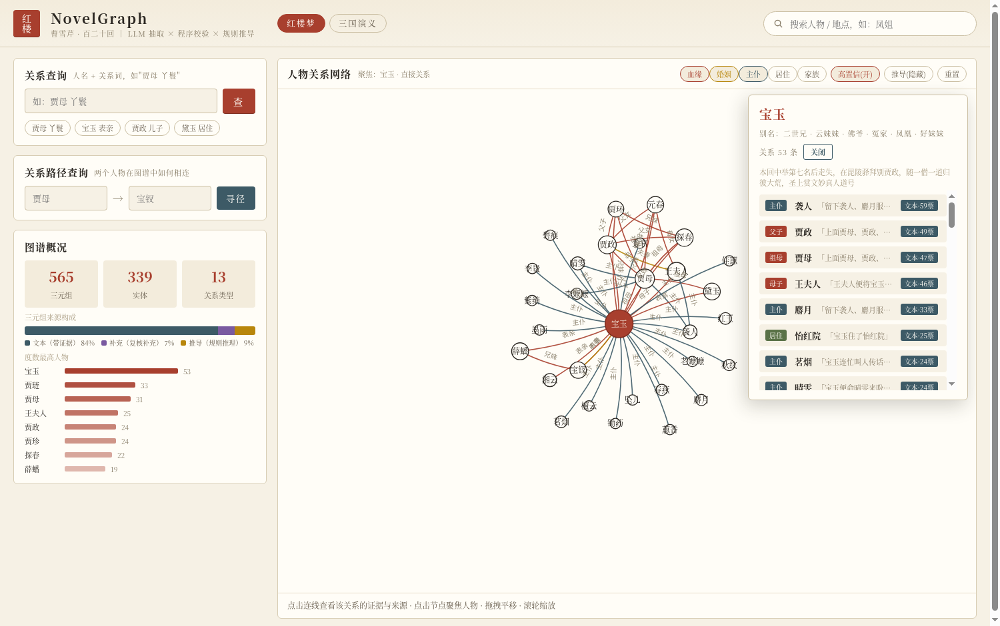
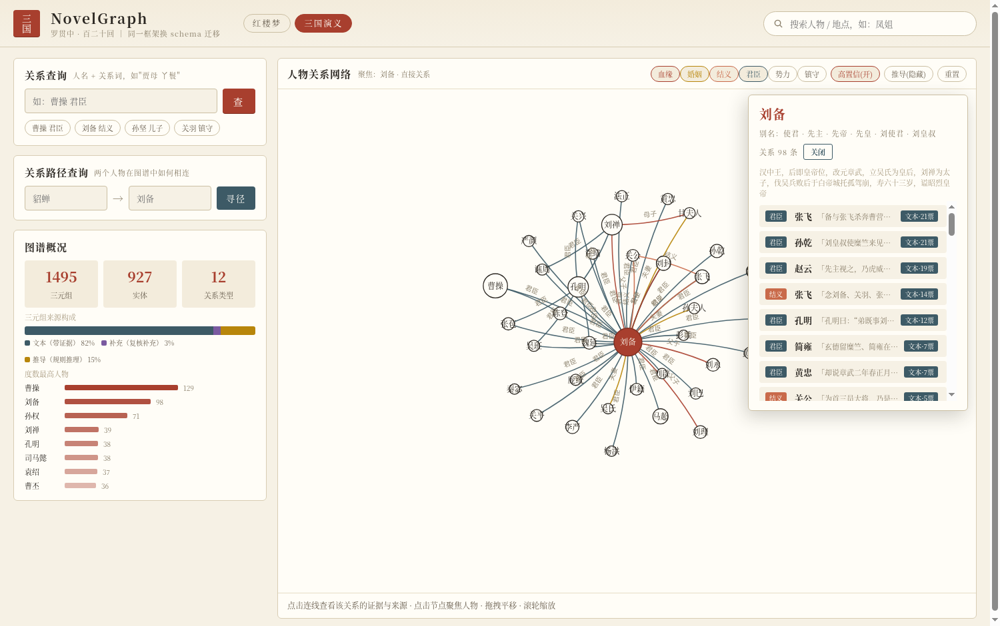

# NovelGraph

**面向长篇小说的人物关系抽取与知识图谱构建框架。** 从一部小说的纯文本出发，自动抽取其中的人物关系并构建一张**可查询、可解释、可审计**的知识图谱。核心特点：Schema 驱动、证据强制、**零手写人物先验**——领域知识全部写在一份 YAML 里，换一份 YAML 即迁移一本新书。以《红楼梦》《三国演义》两部 120 回全书验证。

代码包名 `kgx`（Knowledge Graph eXtraction）。

## 效果

| | 红楼梦（120回） | 三国演义（120回） |
|---|---|---|
| 图谱 | 565 关系 / 1,016 实体 | 1,495 关系 / 1,920 实体 |
| 召回（对人工金标准） | 76.3% | **83.3%**（君臣 83%、结义 3/3） |
| **真实精度**（随机抽检，Wilson CI） | **96%**（48/50） | **95.9%**（47/49）；09-07 重抽检 49/49 | 
| 迁移成本 | — | 仅新增 2 个数据文件，`kgx/` 包零修改 |

抽检凭证：红楼 48/50 的逐条判定见 `runs/hlm_v3_full/human_check_audited_2026-09-04.json`（对应 curation 前图谱，49/50 仍在现图）；三国 09-04 轮 47/49 的逐条记录在定稿重放时被程序覆盖、未保存，09-07 对现行 50 条样本重做抽检：49 对 / 0 错 / 1 存疑，宽口径 49/49（CI 92.7–100%），逐条与口径说明见 `runs/sanguo_v3_full/human_check.json` 与 `human_check_summary_2026-09-07.json`。其中 9 条是"统帅→部将"型君臣（孔明/司马懿/钟会/邓艾等对直接部将），schema 定义含"部将"故计对；若严格要求头为主公，则为 40/49 = 81.6%。这是当前图谱君臣关系的主要残余争议。

两项指标均在**零手写人物先验**下取得——所有领域知识只存在于 `schemas/<书>.yaml`，代码里没有一个具体人名或关系实例。




## 为什么不是"让大模型直接读小说吐关系"

直接让 LLM 通读小说列关系，会遇到三个致命问题，本框架逐一应对：

1. **长文本割裂**——60 万字远超单次上下文，必须分块，但人物关系散落全书。用**滚动登记簿**做跨块工作记忆，让第 80 回抽取时模型仍"记得"第 1 回登记的人物。
2. **幻觉**——模型会凭对名著的记忆补充文本没说的关系。用**防幻觉三板斧**（下述）强制每条关系可溯源。
3. **不可迁移**——为一本书写死逻辑无法复用。用 **schema 驱动**把领域知识收进一份 YAML。

## 方法：九步管线

```
原文
 ├─① 切章打包        章节正则 + 章号连续性校验；3 回/2.4 万字一块
 ├─② 实体预扫描      jieba 六路候选 + 一次 LLM 分类别名分组
 ├─③ 滚动登记簿      实体清单随抽取更新，作为每块上下文（含四重别名守卫）
 ├─④ 整块抽取+补抽    过程式 prompt 抽关系+逐字证据；gleaning 补一轮（均关思考）
 ├─⑤ 程序校验        零 LLM：闭集/类型/方向翻转/证据逐字命中/回原文补证
 ├─⑥ 程序化归并      姓+名全名补全、重复实体合并、同名歧义守卫
 ├─⑦ 聚合计票        方向规范化、按"不同证据句"计票、一父一母冲突裁决
 ├─⑧ LLM 分组复核     按实体分组裁决 + 三护栏 + 补充守卫（开思考）
 └─⑨ 规则推导        schema 声明式规则前向推理，带推导链与置信度
        ↓
   图谱（三层来源标注）+ 分层评估 + 人工审校钩子
```

### 防幻觉三板斧

- **关系闭集约束**：关系类型只能取 schema 声明的十几种，实体必须是登记簿里文中真出现的名字——模型编不出图谱里不该有的边。
- **证据强制**：每条关系必须附一句原文，程序验证这句话真在原文里、且同时提到关系双方；不满足就回原文检索补证，找不到直接丢弃。**最终图谱里每条边都能点开看到出处**——这是"抽取"与"凭记忆回忆"的本质区别。
- **投票聚合**：同一条关系被多次独立抽到才是高票，按不同证据句去重计票，低票过滤。

### 三层可解释来源

每条关系标注来源，可靠性递减、下游按需取用（分层精度实测）：

| 来源层 | 含义 | 红楼实测精度 |
|---|---|---|
| 文本抽取 | 带原文证据句 | 96% |
| 模型知识 | 复核阶段补充，理由须提及双方 | 100% |
| 推导 | 规则前向推理，带完整前提链 | 94% |

### 复核护栏与消融

复核阶段（LLM-as-judge）带三条护栏：**否决必须给类别、高票（≥3 不同证据）保护、方向类否决改翻转再校验**。生产配置经消融实验确定：

| 变体 | 护栏 | 思考 | 全层 F1 |
|---|---|---|---|
| 基线 | ✗ | ✗ | 54.0 |
| +护栏 | ✓ | ✗ | 54.0（分数持平，但方向翻转救回 44 条真事实、错误更干净） |
| **+护栏+思考（采用）** | ✓ | ✓ | **56.6**（思考净贡献 +2.6 F1） |

由此确定：**抽取关思考**（"从原文抄"，思考只烧输出无增益）、**复核开思考**（裁决值 +2.6 F1）。

## 工程可靠性

- **哈希缓存**：所有 LLM 调用按 (模型+请求) 哈希落盘，下游任何改动**秒级零成本重放**；
- **断点续跑 + 自愈**：块级进度落盘、失败不记为完成、自愈外壳自动重拉 → 单书 9–15 小时**无人值守**跑完；
- **限流韧性**：TPM 自适应节流 + 指数退避 + 内容审查逐级拆段 + 重复输出循环检测，全部程序化消化。

## 运行

```bash
python3 -m venv .venv && ./.venv/bin/pip install -r requirements.txt

# 全书抽取 + 评估（provider 默认商汤 OpenAI 兼容网关，配置见 kgx/llm.py 与 .env）
./.venv/bin/python -m kgx.cli run \
    --schema schemas/hongloumeng.yaml --text data/hongloumeng11.txt \
    --out runs/hlm --gold gold.hongloumeng --review-guardrails --review-thinking

# 迁移新书：只需新增 schemas/<书>.yaml + gold/<书>.py，命令同上换参数
./.venv/bin/python -m kgx.cli run \
    --schema schemas/sanguo.yaml --text data/sanguo.txt \
    --out runs/sanguo --gold gold.sanguo --review-guardrails --review-thinking

# 关系图谱面板（多书切换 / 关系筛选 / 点边看证据 / 两人最短路径）
./.venv/bin/python panel.py    # → http://127.0.0.1:8020
```

## 目录布局

| 路径 | 说明 |
|---|---|
| `kgx/` | 框架包，14 个模块：schema / llm / chunking / prescan / registry / extract / validate / resolve / aggregate / review / infer / evaluate / export / cli |
| `schemas/` | 每本书一个 YAML：实体类型、关系闭集与约束、易混判据、推导规则 |
| `gold/` | 评估金标准 + 评估别名表（**仅供 evaluate 引用，绝不进入抽取管线**——考卷与考生物理隔离） |
| `data/` | 小说原文 |
| `runs/<书>_v3_full/` | 最终图谱、分层评估、随机抽检、人工审校记录 |
| `panel.py` + `static/` | 零第三方后端依赖的关系图谱面板 |
| `scripts/` | 单块探针 / 复核消融 / 字号归并 |
| `docs/` | 完整技术文档（方法、模型选型、问题复盘、消融数据、双书终表） |

## 文档

- `docs/项目总结-2026-09-02.md`：方法 / 消融 / 含金量 / 局限
- `docs/待办-2026-09-01.md`：全流程实录——模型选型（4 平台约 10 模型实测）、十余类工程问题的「现象→根因→方案→效果」、消融数据、双书终版对比
- `docs/参考项目借鉴笔记.md`：kg-gen / GraphRAG / AI-Reader-V2 / OneKE 的模块级借鉴清单
